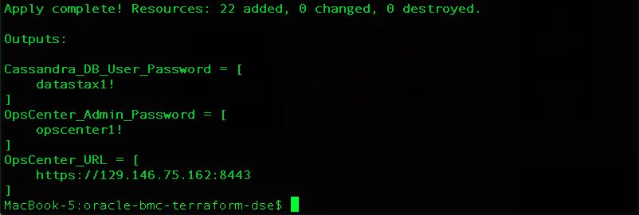
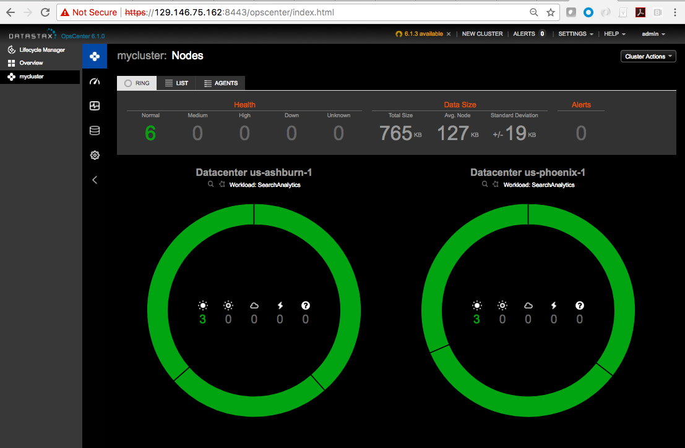
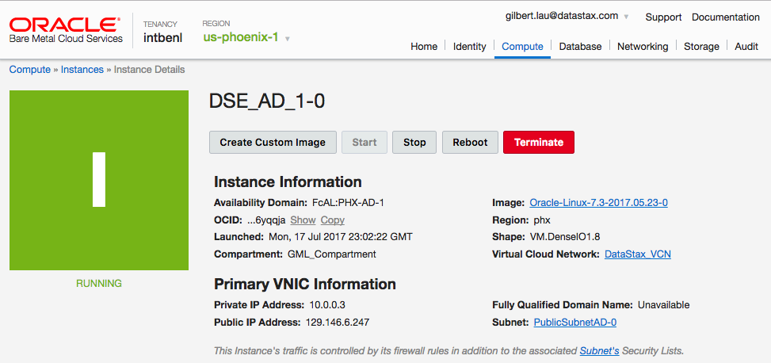

# oracle-bmc-terraform-dse
Oracle Bare Metal Cloud Services Terraform-based provisioning for DataStax Enterprise (DSE)

It creates a virtual cloud network with a route table, Internet Gateway, Security Lists, 3 subnets on different availability domains (ADs) for the DataStax Enterprise cluster nodes and OpsCenter. 

### Prerequisites
* [Follow this link to install Terraform and Oracle BMC Terraform prvoider](https://github.com/oracle/terraform-provider-baremetal/blob/master/README.md) 
* [Follow this link to set up your Oracle BMC's fingerprint](https://docs.us-phoenix-1.oraclecloud.com/Content/API/Concepts/apisigningkey.htm)
* [Follow this link to set up SSH key pair for your Oracle BMC BM or VM instances](https://docs.us-phoenix-1.oraclecloud.com/Content/GSG/Tasks/creatingkeys.htm)

### Using this project
* Update env-vars with the required information.
* Source env-vars
  * `$ . env-vars`
* Update `variables.tf` with your instance options.
* Update \<ssh_private_key_path\> field in `remote-exec.tf` with the absolute path of your SSH private key. For example, `/Users/gilbertlau/.ssh/bmc_rsa`
* Run `terraform plan` and follow on-screen instructions to create and review your execution plan.
* If everything looks good, run `terraform apply` and follow on-screen instructions to provision your DSE cluster.
* If it runs successfully, you will see the following output from the command line.

* The time taken to provision a 3-node DSE cluster is between 10 and 15 minutes long. You can point your browser at http://<OpsCenter_URL> to access DataStax Enterprise OpsCenter to start managing your DSE cluster.

* You can also SSH into the any of the DSE nodes using similar command: `ssh -i <path to your SSH private key> opc@<IP address of a DSE node>`.  You can locate the IP address of your DSE node in Oracle BMC Console's Compute>>Instances>>Instance Details screen.

* When you no longer need the DSE cluster, you can run `terraform destroy` and follow on-screen instructions to de-provision your DSE cluster.

### Files in the configuration

#### `env-vars`
Is used to export the environmental variables used in the configuration. These are usually authentication related, be sure to exclude this file from your version control system. It's typical to keep this file outside of the configuration.

Before you "terraform plan", "terraform apply", or "terraform destroy" the configuration source the following file -  
`$ . env-vars`

#### `compute.tf`
Defines the compute resource

#### `network.tf`
Defines the network resource

#### `remote-exec.tf`
Uses a `null_resource`, `remote-exec` and `depends_on` to execute a command on the instance. [More information on the remote-exec provisioner.](https://www.terraform.io/docs/provisioners/remote-exec.html) 

#### `./userdata/*`
The user-data scripts that get injected into an instance on launch. More information on user-data scripts can be [found at the cloud-init project.](https://cloudinit.readthedocs.io/en/latest/topics/format.html)

#### `variables.tf`
Defines the variables used in the configuration

#### `datasources.tf`
Defines the datasources used in the configuration

#### `outputs.tf`
Defines the outputs of the configuration

#### `provider.tf`
Specifies and passes authentication details to the OBMCS TF provider
